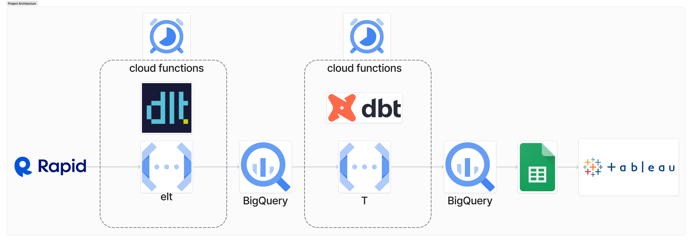

# Data Ingestion and Load with DLT and Rapid API

## Technical Overview

This project focuses on extracting data from Realty in AU's API using the DLT package and Rapid API. The extracted data is then loaded into BigQuery via Cloud Storage.

- The DLT package can be taken to be performing the EtL from EtLT as it is directly unpacking the json in the destination with an infered schema.

### Why can’t we transform data to a perfect state for analytics use at once?

Analytics requirements evolves frequently according to stakeholders’ need, which means it is hard to keep source data up to date to satisfy analyst users’ fast changing need. DLT did light data transformation to ensure we have the data in its rawest format(which includes dups or missing data) then analyst can use dbt to clean and organize data to get what business users’ need in a timely manner.

## Connected REPOS

- DBT models to be executed as a separate cloud function (The T in EtLT):
- https://github.com/JellyBella/dbt-sydney-property

## Final Product

- Sydney Property Pulse: Unveiling Trends, Beyond the Headlines
  https://public.tableau.com/app/profile/bellajiang/viz/SydneyPropertyPulse_UnveilingTrendsBeyondtheHeadlines/RealEstate

## Problem Statement

Some of my friends are in the market for a home and are finding it tough to find useful information, like what's a fair price in certain Sydney suburbs. While Realestate.com.au is popular for property transactions, getting accurate market insights can be tricky. As a skeptical analyst, I've decided to dig into real estate data to find genuine insights that could benefit the thousands of potential property buyers in Sydney.

## Solution

To grasp house prices in specific Sydney suburbs, we require historical data sourced from Realty in AU's API. Utilizing dlt, a library that streamlines the data ingestion process by handling Loading, Schema Management, Data Type Detection, and Scalable Extraction, we direct the requested JSON data to be unpacked directly in BigQuery.

After which, a series of more complicated transformations run (with dbt) helps identify potential duplicate listings among other things. De-duplicating these listings allows for the core analysis to take place being the able to analyse accurately:

- How many listed properties sold last 12 months?
- Which areas have the most sold properties?
- How much does a 3 bedder cost?
- How much do top agents earn?

Link to the tableau dashboard (https://public.tableau.com/app/profile/bellajiang/viz/SydneyPropertyPulse_UnveilingTrendsBeyondtheHeadlines/RealEstate)

## Prerequisites

- Python
- DLT Package
- Rapid API Key
- Google Cloud Platform (GCP) Account

## Setup

1. Clone the repository.
2. Install the required dependencies: `pip install -r requirements.txt`
3. Obtain a Rapid API key and configure it.
4. Set up Google Cloud Storage and BigQuery.
5. Configure the realestate.py script to your personal target area.

## Usage

1. The repo is setup to be run on cloud functions.
2. Monitor Cloud Storage for ingested data.
3. Explore the loaded data in BigQuery and then whichever visualisation tool you choose to connect.

## Further development

- Realestate.com.au lacks certain sold listings, some properties were only listed on Domain.com.au (2nd largest in Australia).
- By integrating NSW Property Sales Information (PSI), we can cross-reference property prices for enhanced accuracy.
